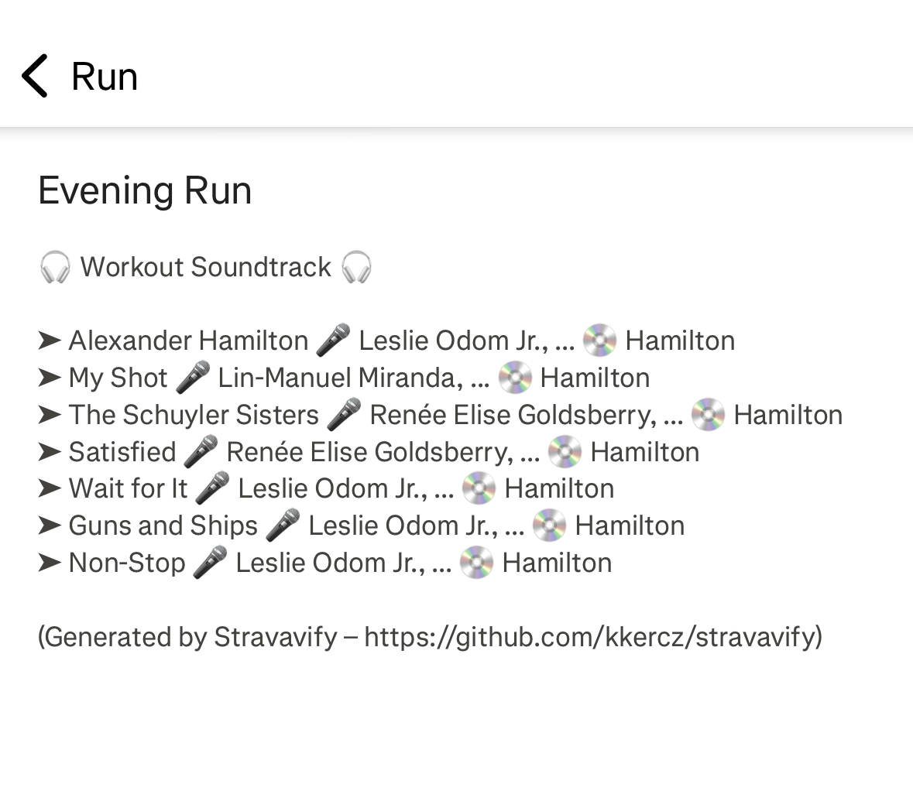

# Stravavify

This is a small Java program (wrapped as a GitHub Action) that automatically updates your
**Strava activity descriptions** with a **list of songs you played on Spotify during your workout**.

You go for a run, bike ride, or gym session → listen to music on Spotify → finish the workout → and soon after,
your Strava description shows the playlist you had blasting in your ears.

---

## 💡 What This Is

- Built in Java using [Retrofit](https://square.github.io/retrofit/) / [Moshi](https://github.com/square/moshi/) to
  connect with Strava
  and [spotify-web-api-java](https://github.com/spotify-web-api-java/spotify-web-api-java) to connect with Spotify
- Designed to run **as a scheduled GitHub Action**.
- If you fork this repo and set your personal API keys/secrets, the action will start working for you automatically (no
  hosting needed).

## 🛠️ How It Runs

The GitHub Action is scheduled (by default: once a day) via a cron trigger.

It:

* Gets your latest Strava activity that doesn't have any description yet.
* Queries Spotify for the songs you played during that time.
* Updates the Strava activity description with a list of tracks.

Here is an example description that it generates:



---

## 🚀 Setup

### 1. Required Environment Variables

Before running, the action needs API credentials and tokens from both **Spotify** and **Strava**.  
In your forked the repo, go to **Settings → Secrets and variables → Actions → Repository secrets** and set the
following:

| Variable Name           | Purpose                |
|-------------------------|------------------------|
| `SPOTIFY_CLIENT_ID`     | From your Spotify App  |
| `SPOTIFY_CLIENT_SECRET` | From your Spotify App  |
| `SPOTIFY_REFRESH_TOKEN` | User-level OAuth token |
| `STRAVA_CLIENT_ID`      | From your Strava App   |
| `STRAVA_CLIENT_SECRET`  | From your Strava App   |
| `STRAVA_REFRESH_TOKEN`  | User-level OAuth token |

---

### 2. How to Obtain Your Tokens 🔑

#### Spotify Credentials:

- Create an app at: https://developer.spotify.com/dashboard
- Set your **redirect URI** to something like:  
  `http://localhost:8888/callback` (You won't actually deploy this, just needed for manual auth step)

- Then go through the **OAuth Authorization Code Flow**:

1. Direct your browser to
   https://accounts.spotify.com/authorize?client_id=YOUR_CLIENT_ID&response_type=code&redirect_uri=http://localhost:8888/callback&scope=user-read-playback-position,user-read-recently-played

2. After you authorize, Spotify will redirect you to your localhost URL with a `code` parameter.

3. Exchange that `code` for a refresh token by making a POST request to https://accounts.spotify.com/api/token
   with body parameters:

```
    - grant_type=authorization_code
    - code=THE_CODE
    - redirect_uri=http://localhost:8888/callback
    - client_id=YOUR_CLIENT_ID
    - client_secret=YOUR_CLIENT_SECRET
```

Keep the refresh_token you get. That's what this program will use.

#### Strava Credentials:

- Create an app at: https://www.strava.com/settings/api

- For Authorization Callback Domain, you can use something like localhost (you won’t deploy this anyway).

- Then, follow Strava OAuth flow manually:

1. Direct your browser
   to: https://www.strava.com/oauth/authorize?client_id=YOUR_CLIENT_ID&response_type=code&redirect_uri=http://localhost&approval_prompt=force&scope=activity:read_all,activity:write

2. After authorizing, you'll be redirected to localhost with a `code` parameter.

3. Exchange that `code` for a refresh token.
   POST to https://www.strava.com/oauth/token with body parameters:

```
- client_id=YOUR_CLIENT_ID
- client_secret=YOUR_CLIENT_SECRET
- code=THE_CODE
- grant_type=authorization_code
```

Again, save the refresh_token. That’s what the program needs.